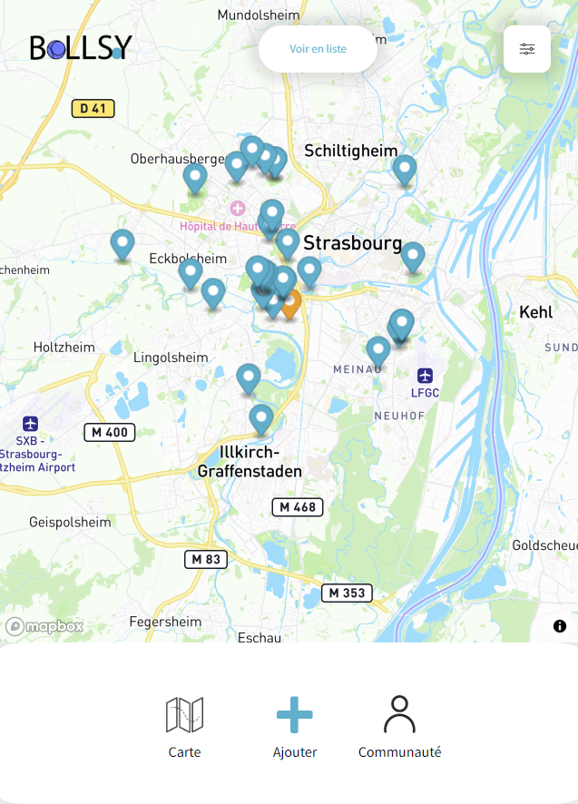

# HACKATHON 24H : BALLSY

🎉 Ce projet est une application basée sur JavaScript, conçue lors d'un hackathon de 24 heures sur le thème du voyage.  
Elle utilise la géolocalisation et un API pour localiser les terrains de pétanque à proximité de soit.  
Elle a été réalisé dans le cadre de notre formation au sein de la Wild Code School de Strasbourg.

---

## ✨ Caractéristiques

- Utilise la géolocalisation pour déterminer votre position actuelle.
- Consomme un API pour trouver les terrains de pétanque autour de vous.
- Affiche une carte avec les terrains de pétanque à proximité.
- Permet de lister les installations spécifiques (éclairage, type de sol etc..)

---

## ✨ Contributions et Remerciements

Comme ce projet a été créé dans le cadre d'un hackathon, nous ne prévoyons pas de maintenir activement ce dépôt pour le moment.

Ce projet a été développé dans le cadre de notre formation à la Wild Code School de Strasbourg par :

- Benjamin Zilliox
- Ludivine Martel
- Radu Bobes
- Philibert Etienne
- Antoine Borda

🔥 Merci à notre formateur : Yavuz Kutuk  
🔥 Merci à nos camarades de promo qui permettent des échanges enrichissants
